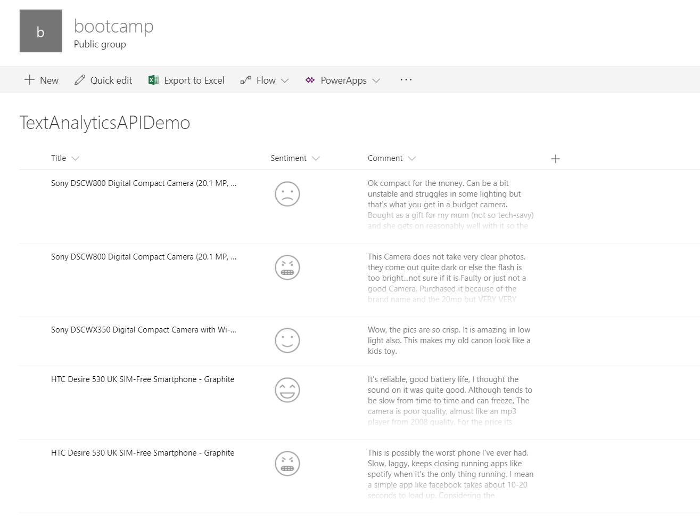

# Office365 Developer Bootcamp 2017

En este repo podrás encontrar el material utilizado en el Office 365 Developer Bootcamp 2017 en Madrid, durante el cual hice una sesión sobre como utilizar Cognitive Services con spfx.

## Demo mostrada durante la sesión teórica
Durante la sesión teórica, vimos una demo sobre como utilizar la Vision API para extraer información de imágenes. Puedes encontrar la el proyecto de la demo en mi Fork del repositorio del PnP para spfx-extensions: [https://github.com/luismanez/sp-dev-fx-extensions/tree/react-command-vision-api-v2/samples/react-command-vision-api](https://github.com/luismanez/sp-dev-fx-extensions/tree/react-command-vision-api-v2/samples/react-command-vision-api)

En el momento del bootcamp (4 Nov 2017), este ejemplo se ha enviado como contribución al PnP, pero todavía no ha sido aceptado. En principio estará disponible como parte del PnP en los próximos días.

## Laboratorio
Durante el tiempo dedicado al laboratorio, pondremos en practica algunos de los conceptos mostrados durante la sesión teórica y la demo. 
En este caso, vamos a utilizar la Text Analytics API de Cognitive Services [https://azure.microsoft.com/en-us/services/cognitive-services/text-analytics/](https://azure.microsoft.com/en-us/services/cognitive-services/text-analytics/) para anlizar el sentimiento de un fragmento de texto almacenado en una lista de SharePoint.
Una vez obtenido el 'sentiment', nuestro spfx Field Customiser, lo mostrará utilizando un icono:

